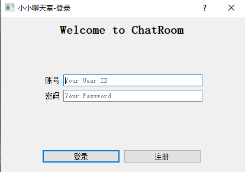
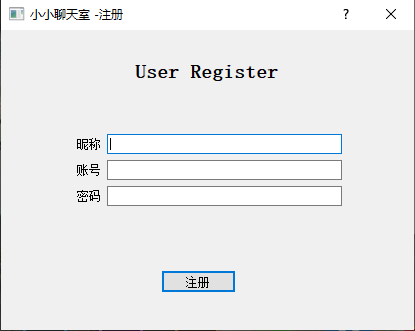
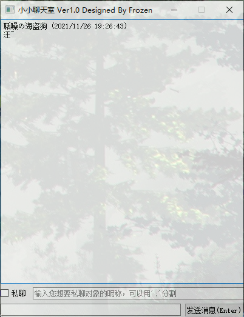

# UDP ChatRoom
- **Author：Frozen**
- **Date：2021/11/17**
- 时间有限，主要以练习Socket编程和理解UDP为目的，代码质量并不高

## 效果展示
### 登录界面

### 注册界面

### 聊天界面


## 所需组件
- 请安装 PyQt5.15.6 及以上版本

## 基本功能
- 基于UDP实现的一个多人聊天室
- 支持登录、注册、群聊、私聊（可同时指定多人）
- 如果需要部署远端服务器，请修改Server.py和Client.py的ServerBook全局变量
- 如果需要将客户端打包成exe，可以安装pyinstaller并执行指令（windows）
```cmd
pyinstaller -F -w -i ./images/chatroom.ico Client.py
```
